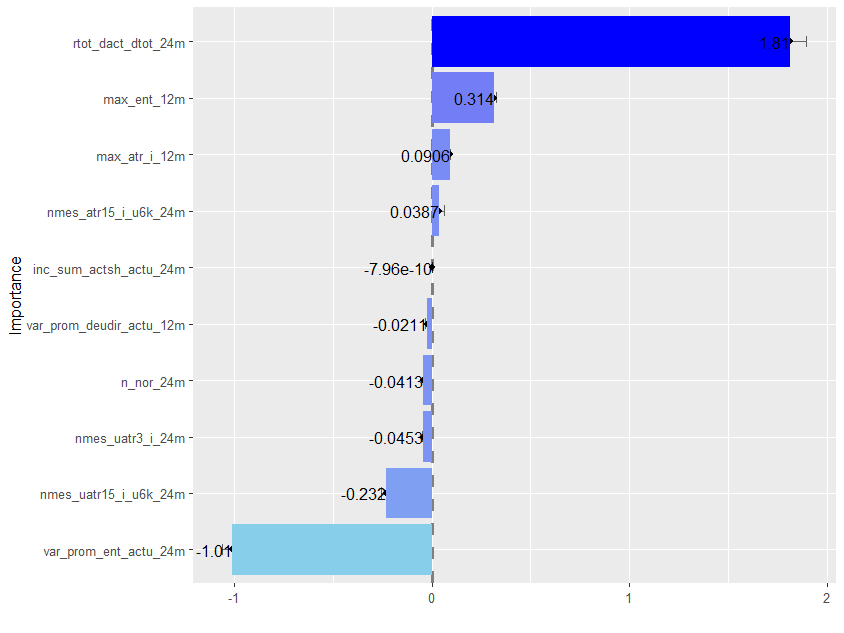
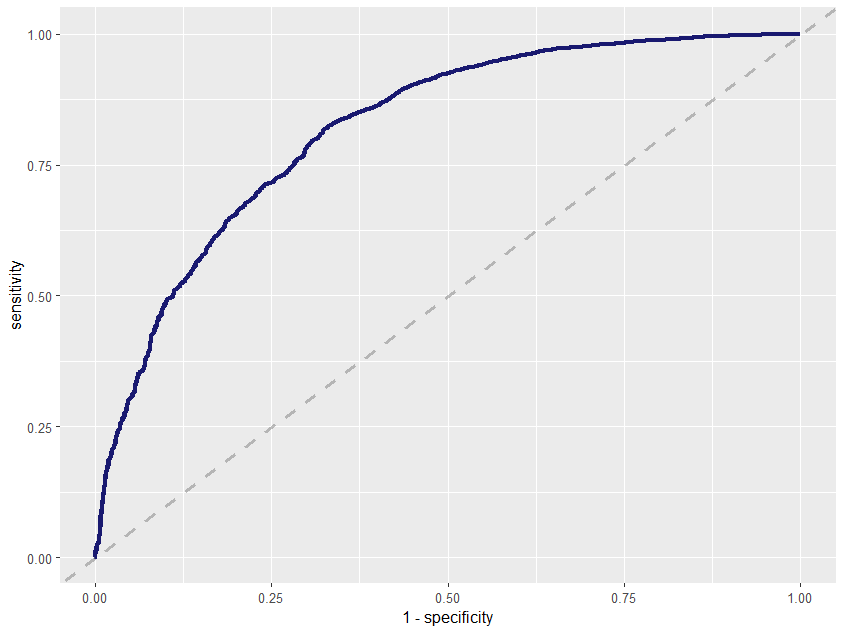
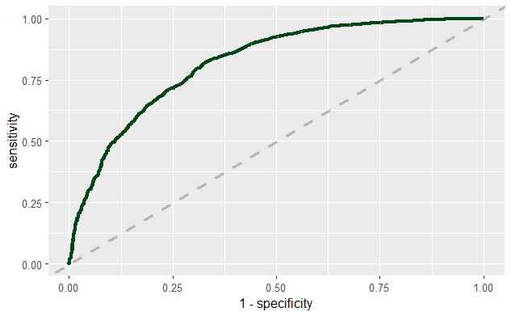

```{r setup, include=FALSE}
knitr::opts_chunk$set(echo = FALSE)
```

# Resumen

El propósito del siguiente póster es dar a conocer la estimación de la `probabilidad de impago` para medir el riesgo crediticio de una entidad financiera. Se puso en práctica un modelo de métodos estadísticos, así como también uno basado en el aprendizaje automatizado (`Machine Learning`). En la investigación, se muestra la implementación (R + Python) y uso del algoritmo “`Random Forest`” de aprendizaje automatizado para construir un modelo que prediga la probabilidad de impago en función de algunos indicadores de riesgo del portafolio de clientes de una institución financiera. Se muestra la aplicación de los modelos: "`Regresión logística`" y el algoritmo "Random Forest", de donde se tiene que el modelo generado por el algoritmo Random Forest es el más efectivo para nuestro conjunto de datos, puesto que se muestra la comparación en términos de la métrica de evaluación del área bajo la curva (AUC).

***Palabras Clave:*** *Probabilidad de Impago*, *Machine Learning*, *Regresión Logística*, *Random Forest*.


# Introducción

En la última década se ha hecho evidente la participación activa de las entidades financieras, mas aún en la época actual de `reactivación económica` del pais. Es por ello que en estas entidades se presentan nuevos usuarios o clientes, por lo que nos interesaria conocer acerca de la `probabilidad de impago` que estos puedan presentar, mediante el aprendizaje supervisado.

Se plantearon los siguientes objetivos: Evaluar modelos para conocer la `probabilidad de impago` o `Default`, determinar el modelo estadístico de mayor precisión y finalmente dar a conocer el package `posterdown` como herramienta de `Rmarkdown` para la creación de posters. [@R-posterdown].

# Metodología

Se han utilizado una data de 50,206 registros con 44 variables que fueron recopilados por una entidad financiera durante el periodo: Enero - 2017 a Marzo - 2018. 

**Figura 1:** *Pasos del Modelamiento*

{width="100%"}

En `Data Understanding` se ha visualizado que existen datos perdidos, por lo que se le ha aplicado una metodología de `Feature Engineering Selection` en `Python`, para elegir las 10 variables mas significativas.

A estas variables se le aplicamos dos modelos predictivos (`Model Selection`), que puedan determinarnos la `probabilidad de impago` de un cliente. [@rk1]

# Resultados

Se han aplicado 2 modelos: `Logistic Regression` y `Random Forest`; teniéndose como variable respuesta `Default`, el cual presenta la característica de ser `dicotómica`, teniéndose: `0 = No Default` y `1 = Default`, de los cuales se obtuvo los siguientes resultados: [@tm1]

**Regresión Logistica**

**Figura 2:** *Matriz de confusión - Reg Log*

```{r,warning=FALSE,message=FALSE,out.width="95%",fig.align='center'}
library(magrittr)
library(dplyr)
library(ggplot2)
library(caret)
x<-readRDS("imagenes/x.rds")

table <- data.frame(x$table)
plotTable <- table %>%
  mutate(goodbad = ifelse(table$Prediction == table$Truth, "good", "bad")) %>%
  mutate(prop = Freq/sum(Freq))

ggplot(data = plotTable, mapping = aes(x = Truth, y = Prediction, fill = goodbad, alpha = prop)) +
  geom_tile() +
  geom_text(aes(label = Freq), vjust = .5, alpha = 1,size=8) +
  scale_fill_manual(values = c(good = "green", bad = "red")) +
  xlim(rev(levels(table$Truth)))+
  xlab("Truth")+
  theme(legend.position='none')+theme(axis.title = element_text(size = 15,color = "black", face = "bold"))
```

***Modelo: Regresión Logística***

$$log\frac{\rho}{1-\rho}=-2.43+(-1.01*X_1)+(-0.23*X_2)+$$
$$(-0.05*X_3)+(-0.04*X_4)+(-0.02*X_5)+$$
$$0.00*X_6+0.04*X_7+0.09*X_8+0.31*X_9+$$
$$1.81*X_{10}$$

**Figura 3:** *Clasificación de parametros - Regresión Logística*

{width=95%}


**Figura 4:** *`Curva ROC: Regresión Logística`*

{width="90%"}

**Random Forest**

**Figura 5:** *Matriz de confusión - Random Forest*

```{r,warning=FALSE,message=FALSE,out.width="75%",fig.align='center'}
library(magrittr)
library(dplyr)
library(ggplot2)
library(caret)
x1<-readRDS("imagenes/mcRF.rds")

table <- data.frame(x1$table)
plotTable <- table %>%
  mutate(goodbad = ifelse(table$Prediction == table$Truth, "good", "bad")) %>%
  mutate(prop = Freq/sum(Freq))

ggplot(data = plotTable, mapping = aes(x = Truth, y = Prediction, fill = goodbad, alpha = prop)) +
  geom_tile() +
  geom_text(aes(label = Freq), vjust = .5, alpha = 1,size=8) +
  scale_fill_manual(values = c(good = "green", bad = "red")) +
  xlim(rev(levels(table$Truth)))+
  xlab("Truth")+
  theme(legend.position='none')+theme(axis.title = element_text(size = 15,color = "black", face = "bold"))
```

**Figura 6:** *`Curva ROC: Random_Forest`*

{width="80%"}

Realizamos la comparación de los modelos mediante `ROC_AUC` de cado uno de ellos, obteniendose:

**Figura 7:** *Comparación de modelos predictivos*

```{r,warning=FALSE,message=FALSE,out.width="75%", fig.align='center'}
library(ggplot2)
Value <-c(0.8089,0.8192)
Model <-c("Reg_Log","Ran_For")
ci <-c(0.003,0.003)
matriz <- data.frame(Model,Value,ci)
graf<-ggplot(matriz,aes(Model,Value))+
  geom_point(aes(colour=Model),size=3) + geom_errorbar(aes(ymin=Value-ci,ymax=Value+ci,colour=Model))+geom_label(aes(label=Value),hjust=-0.5)+labs(x="Modelo Predictivo",y="ROC_AUC")
graf
```


# Conclusión

En conclusión, se tiene que el modelo `Random Forest` es el modelo predictivo con mejores características si se quiere determinar la `probabilidad de impago` de un cliente. 
Puesto que cuenta con una mayor precisión que el modelo `Regresión Logística`. [@ifrs]

Try `posterdown` out! Hopefully you like it!

#  Referencias


